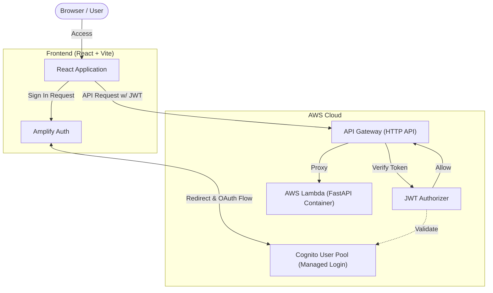

# React + Cognito Managed Login POC

このプロジェクトは、React と AWS Cognito (Managed Login) を組み合わせたサーバーレス・アーキテクチャのプロトタイプ（POC）です。
ユーザー情報を DynamoDB に持たず、Cognito 内のみで管理し、セキュアな API 連携までを一気通貫で検証した構成となっています。

## アーキテクチャ図

### 採用技術スタック
- **Frontend**: React, TypeScript, Vite, AWS Amplify, Playwright
- **Backend**: Python, FastAPI, AWS Lambda Web Adapter, boto3, Pytest
- **Auth**: Amazon Cognito User Pool
- **IaC**: Terraform (App / ECR 分割管理)

## ディレクトリ構成

- `frontend/`: React アプリケーション。ローカル/実環境の切り替え対応。
- `backend/`: API 用の FastAPI アプリケーション。コンテナビルド用 Dockerfile を含む。
- `terraform/`: AWS リソースをデプロイするための構成ファイル（`app/` と `ecr/` に分割）。
- `docs/adr/`: プロジェクトにおける重要なアーキテクチャ設計決定記録 (ADR)。
- `AGENTS.md`: AI アシスタントとの協調開発用ルール定義。

## 開発・実行手順
各コンポーネントの詳細な起動方法やデプロイ手順については、それぞれの README を参照してください。

1. **[terraform/README.md](./terraform/README.md)**: IaC リソースの構成とデプロイ手順
2. **[frontend/README.md](./frontend/README.md)**: React アプリの開発手順と E2E テスト実行方法
3. **[backend/README.md](./backend/README.md)**: FastAPI の起動方法とテスト実行方法

## AI との開発ルールについて
本プロジェクトでは AI アシスタント (Antigravity) と協調して開発を行うための厳格なルール (`AGENTS.md`) を敷いています。コミットの自動実行の禁止やテスト・Lintの義務化、ADR 草案の自発的な作成などが定義されています。

---

## 付録: POC で検証・達成したことの詳細

1. **Cognito Managed Login (Hosted UI) を用いたフロントエンド認証**
   - Amplify Auth (Gen 2) を使用し、React アプリケーションから Cognito の提供するログイン画面へリダイレクトし、セキュアに JWT トークンを取得するフローを実装しました。
2. **API Gateway (HTTP API) + Cognito Authorizer による API 保護**
   - フロントエンドから送信された JWT トークンを API Gateway 側で自動検証し、有効なリクエストのみをバックエンドへ通過させる構成を Terraform で構築しました。
   - 課題となりやすい CORS プリフライト（OPTIONS リクエスト）の認証回避設定も組み込み済みです。
3. **FastAPI を変更なしで Lambda にデプロイするコンテナアーキテクチャ**
   - バックエンドには Python の FastAPI を採用し、`AWS Lambda Web Adapter` を用いることで、ASGI アプリケーションを書き換えることなくコンテナイメージとしてデプロイ・実行しています。
4. **モックモードと実環境のシームレスな切り替え**
   - フロントエンド・バックエンドともに、AWS 上にデプロイしなくてもローカル単体で動作・テストが可能なモックモード（DI / Context 切替）を実装しています。
5. **E2E テスト (Playwright) による自動検証**
   - 実際の Cognito ログイン画面をヘッドレスブラウザで操作し、API からのユーザー情報取得までを通しで検証する ATDD（受け入れテスト駆動開発）を実践しました。
6. **Managed Login (Hosted UI) のデザイン変更と仕様制約の検証**
   - Terraform (`aws_cognito_user_pool_ui_customization`) を用いて、Managed Login 画面のロゴ画像や CSS (背景色やボタンの色など) をカスタマイズできることを確認しました。
   - **仕様の限界と制約**: サインアップ画面への直接遷移ができない点（単一のエントリポイントの強制）や、一部のリンクテキスト（"Sign up" リンクなど）の色がカスタム CSS から上書きできないという、Cognito Hosted UI 固有の制限を検証・特定しました。
7. **Managed Login における自己サインアップの制限検証**
   - 業務システム等で一般的に求められる「管理者のみがユーザーを作成できる（ユーザーによる勝手な登録を防ぐ）」要件を満たすため、Terraform の `admin_create_user_config` で `allow_admin_create_user_only = true` を設定できることを検証しました。
   - この設定により、Managed Login 画面から「Sign up」への導線が完全に非表示となり、意図せぬアカウント追加をセキュアに防止できることを確認しました。
8. **Cognito デフォルト属性 (OIDC) の GUI 編集と仕様制約の検証**
   - Amplify SDK (`updateUserAttributes`) を用いて、フロントエンドから Cognito の標準属性 (name, family_name, birthdate 等) を直接更新できる GUI を実装しました。
   - **スコープの制約**: クライアントから属性を更新するには、Terraform (App Client) 側で `read_attributes` / `write_attributes` を許可するだけでなく、OAuth スコープに Cognito 独自の `aws.cognito.signin.user.admin` を要求する必要があることを検証しました。
   - **updated_at の制約**: OIDC 標準の `updated_at` 属性は、AWS (Cognito) 側では自動更新されません。そのため、アプリケーション側で現在時刻 (UNIXタイムスタンプ) を計算し、更新リクエストに毎回含めて送信する仕様となっています。
   - **email 更新の制約**: `email` をサインインエイリアスとして利用している場合、単純な更新を許可すると次回以降のログインが不能になるリスクがあるため、フロントエンドからの直接編集は Read Only (更新不可) とするよう設計方針を定めました。
9. **API Gateway と Lambda (FastAPI) を横断した監査ログと JSON 構造化の実装**
   - 本番運用を見据え、API Gateway のアクセスログと FastAPI のアプリケーションログの両方で、リクエストを実行したユーザーを一意に特定するためのログ出力（監査ログ）を実装しました。
   - 個人情報 (PII) 保護の観点から、`email` 等はログに出力せず、Cognito 発行の UUID である `sub` のみを記録する方針を決定しました。
   - バックエンドには `AWS Lambda Powertools` を導入し、ログの JSON 構造化を実施しました。認証ミドルウェアで抽出した `sub` を `logger.append_keys` やミドルウェア経由で注入することで、Uvicorn のアクセスログや以後のすべてのビジネスロジックログに**自動的にユーザーIDが付与される**堅牢なロギング機構を構築しました。
