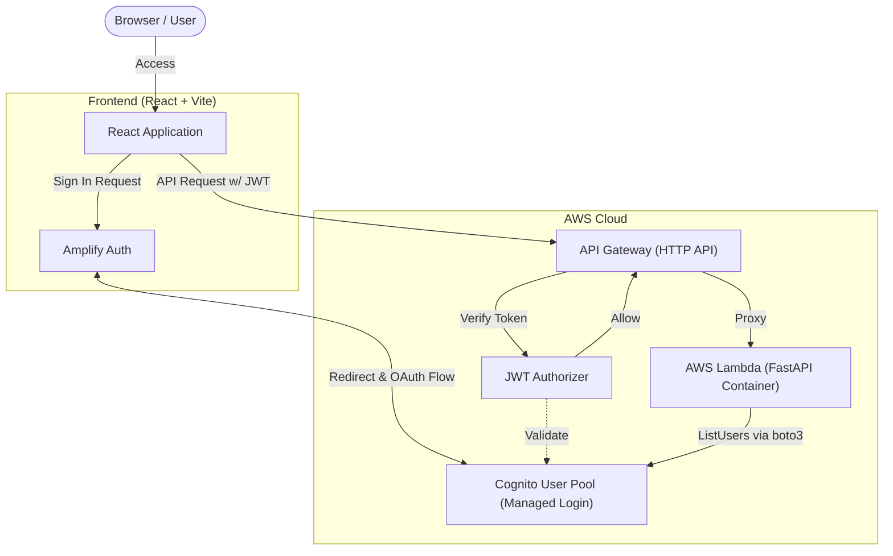
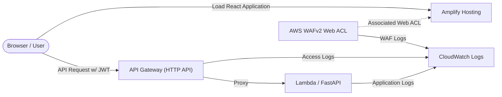

# アーキテクチャ

リポジトリのアプリケーションと Terraform に定義された現在の構成を示します。
各 POC の検証結果・制約は [POC 一覧](./poc/README.md)、設計判断の理由は [ADR](./adr/) を参照してください。

## 認証・API の構成

- フロントエンドは Amplify Auth を通じて Cognito のログイン画面へ遷移し、取得した JWT を API リクエストに付与します。
- API Gateway の JWT Authorizer が認証を担い、FastAPI は Lambda Web Adapter 経由で動作します。
- `GET /api/health` と CORS プリフライト用の `OPTIONS /api/{proxy+}` は、JWT 認証を要求しないルートとして定義されています。
- バックエンドは IAM ロールの権限で Cognito の `ListUsers` を呼び出します。ユーザー情報は Cognito 内で管理します。
- 属性編集はフロントエンドから Amplify Auth の `updateUserAttributes` を通じて Cognito に送信します。
- MFA は Terraform で `OFF` / `OPTIONAL` / `ON` と TOTP を設定可能です。デフォルトは無効で、POC 用設定により TOTP 必須を適用します。Essentials プラン・Hosted UI classic（バージョン1）の実環境で、TOTP 登録・再ログイン・API 連携を検証しています。初回の QR 登録手順と結果は [POC 005](./poc/005-mfa-foundation.md) を参照してください。

## 配信・ログの構成

- フロントエンドのビルド成果物は `frontend/scripts/deploy.sh` から Amplify Hosting へアップロードします。
- Terraform は Amplify Hosting に関連付ける WAF Web ACL と、その CloudWatch Logs 出力先を定義しています。現在の Web ACL はデフォルト許可で、ブロック用ルールは定義されていません。
- API Gateway のアクセスログには、リクエスト情報・`sub`・認可エラーの出力項目を設定しています。
- FastAPI は Lambda Powertools を利用して JSON 形式のアプリケーションログを出力します。
- 監査ログの設計方針は [ADR 0005](./adr/0005-audit-logging-strategy.md)、Cognito 側の防御策の検討は [ADR 0006](./adr/0006-cognito-security-and-waf-strategy.md) に記録しています。

## ローカル開発・テスト

- フロントエンドは `VITE_USE_MOCK_COGNITO`、バックエンドは `USE_MOCK_COGNITO` により、モックと実 Cognito への接続を切り替えます。
- モック E2E は Playwright が frontend と backend を起動し、ログインからユーザー一覧取得までを検証します。
- 実環境 E2E は Cognito を経由する認証、属性編集、画面遷移を検証します。

## インフラとデプロイ

Terraform は `terraform/ecr/` と `terraform/app/` の2つの State に分割しています。
初回は ECR を作成し、バックエンドのコンテナイメージを Push してから、アプリケーションのインフラを作成します。

- [Terraform のデプロイ手順](../terraform/README.md)
- [Frontend の開発手順](../frontend/README.md)
- [E2E のテスト手順](../e2e/README.md)
- [Backend の開発・テスト・デプロイ手順](../backend/README.md)

[プロジェクト README へ戻る](../README.md)
