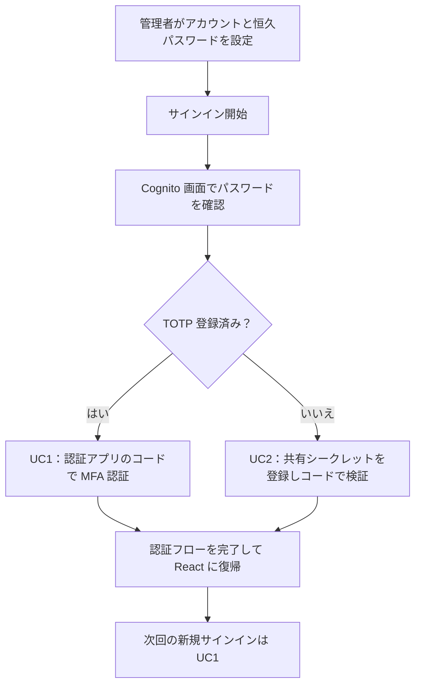
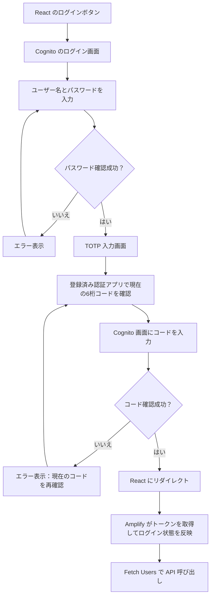
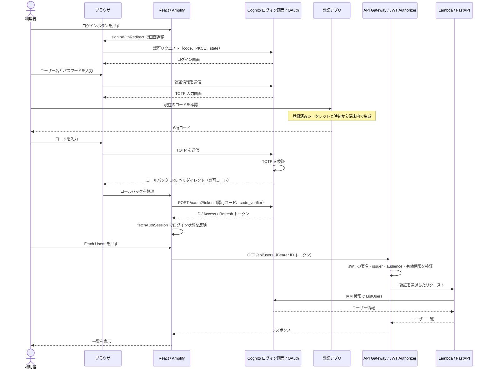
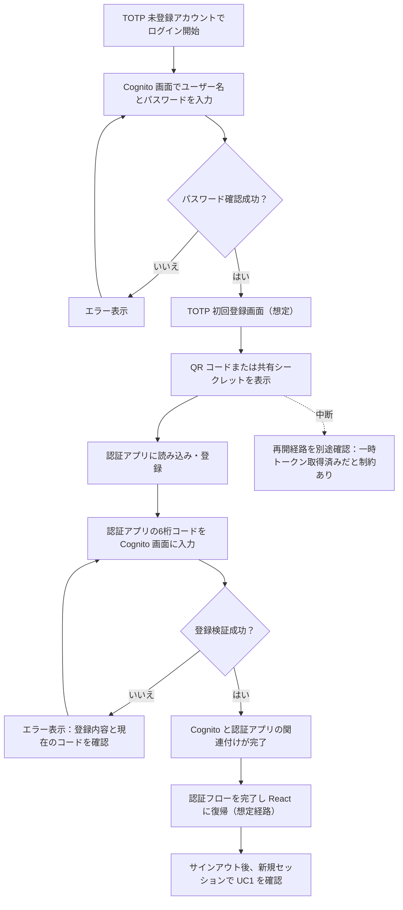
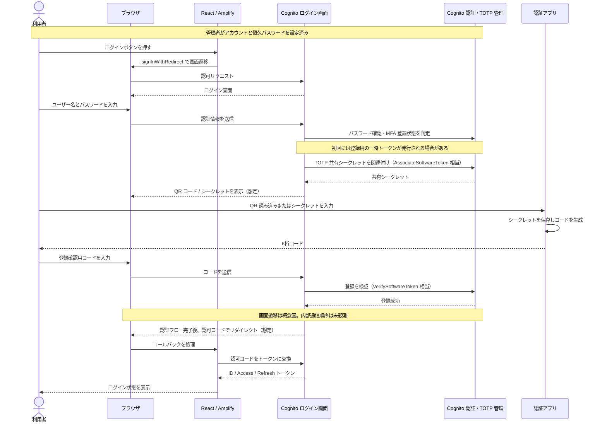

# MFA のユースケースと認証フロー

サインインを入口に、TOTP 登録済みユーザーと未登録ユーザーの違いを整理する。
フロー図は利用者の操作と分岐、シーケンス図は各コンポーネントの役割と通信を示す。
環境構築・操作手順・検証結果は [POC 005](./poc/005-mfa-foundation.md)、全体構成は [アーキテクチャ](./architecture.md) を参照する。

## 目次

- [前提と図の読み方](#前提と図の読み方)
- [アカウント作成・TOTP 登録・MFA 認証の違い](#アカウント作成totp-登録mfa-認証の違い)
- [UC1：TOTP 登録済みユーザーのサインイン](#uc1totp-登録済みユーザーのサインイン)
  - [利用者から見たフロー](#利用者から見たフロー)
  - [コンポーネント間のシーケンス](#コンポーネント間のシーケンス)
- [UC2：TOTP 未登録ユーザーの初回サインイン](#uc2totp-未登録ユーザーの初回サインイン)
  - [利用者から見たフロー](#利用者から見たフロー-1)
  - [コンポーネント間のシーケンス](#コンポーネント間のシーケンス-1)
  - [確認済みの SDK 登録経路との違い](#確認済みの-sdk-登録経路との違い)
- [図に登場するコード・トークンの区別](#図に登場するコードトークンの区別)

## 前提と図の読み方

- 対象はパスワードと TOTP の2要素認証。User Pool は MFA `ON`、TOTP 有効。
- 現在の検証環境は管理者によるユーザー作成のみを許可している。管理者が恒久パスワードを設定した、TOTP 未登録ユーザーを初回登録の対象とする。
- React は Amplify の `signInWithRedirect()` を使う。ログイン・TOTP 入力画面は Cognito が提供する。現在の実環境は Hosted UI classic（バージョン1）。
- シーケンス図の「React / Amplify」はブラウザ内で動作する。独立したサーバーではない。
- 図は新しいブラウザセッションで開始する。既存のログインセッション・トークン更新による画面省略は別の検証対象とする。

| ユースケース | 図の位置づけ | 現在の確認状況 |
| --- | --- | --- |
| 1. 登録済みユーザーのサインイン | 現在の実装と実環境の正常経路 | Hosted UI の TOTP 入力、React 復帰、Users API を E2E で確認 |
| 2. 未登録ユーザーの初回サインイン | AWS 仕様に基づく登録完了までの想定経路 | SRP / MFA_SETUP による登録は確認済み。QR 登録画面の詳細・内部通信順序は未検証 |

## アカウント作成・TOTP 登録・MFA 認証の違い

| 処理 | 目的 | 今回の入口 |
| --- | --- | --- |
| アカウント作成 | Cognito にユーザーを作り、パスワード等を設定する | 管理者が事前に作成。自己サインアップは対象外 |
| TOTP の初回登録 | ユーザーと認証アプリに共有シークレットを設定し、コードで関連付けを検証する | 未登録ユーザーの初回サインイン |
| TOTP による MFA 認証 | 登録済みの認証アプリが生成したコードで追加認証する | 登録済みユーザーのサインイン |

メールアドレスの検証と TOTP 登録は別の処理。現在のテストユーザーは管理者がメール検証済み属性を設定しており、確認メール受信は検証していない。

UC2 は登録が完了する想定経路を示す。登録中断や一時トークンの扱いは後述する。
必須 MFA の初回登録では、登録前に一時的なトークンが発行される場合があるため、「未登録ならトークンは一切発行されない」とは解釈しない。
[AWS：TOTP の初回登録と制約](https://docs.aws.amazon.com/cognito/latest/developerguide/user-pool-settings-mfa-totp.html)

## UC1：TOTP 登録済みユーザーのサインイン

### 利用者から見たフロー

パスワードの確認後、Cognito が TOTP 入力画面を表示する。QR コードによる登録は繰り返さない。

再試行の矢印は、画面で再試行可能な場合を表す。試行上限やセッション失効時の復旧は別途扱う。
POC では使用済み TOTP の再利用が拒否されることを確認した。連続したログインには次の30秒枠のコードを使う。

### コンポーネント間のシーケンス

認証アプリから Cognito にコードを送信する通信はない。利用者がコードを読み、Cognito の画面に入力する。
認可コードからトークンへの交換は Amplify が処理する。
[AWS：トークンエンドポイント](https://docs.aws.amazon.com/cognito/latest/developerguide/token-endpoint.html)

このプロジェクトの Users API は ID トークンを受け付ける構成で、バックエンドは IAM 権限でユーザー一覧を取得する。
API 呼び出しごとに TOTP を要求する実装や、API が直前の MFA 実施を検証する実装は追加していない。

## UC2：TOTP 未登録ユーザーの初回サインイン

### 利用者から見たフロー

管理者によるユーザー作成と恒久パスワード設定を済ませた状態から開始する。
仮パスワード変更、自己サインアップ、メール確認の画面はこの図に含めない。

### コンポーネント間のシーケンス

以下は Hosted UI による登録の役割を示す概念図。画面遷移と内部 API の呼び出し順序を実環境で観測した記録ではない。
Cognito 内の関連付け・検証は公開 API の役割に対応させており、React にこれらの呼び出しを実装しているという意味ではない。

`AssociateSoftwareToken` は共有シークレットを発行し、`VerifySoftwareToken` は利用者が生成できるコードで登録を検証する。
登録処理の認可には Access トークンまたは認証チャレンジの Session を使い、ID トークンは使わない。
[AWS：AssociateSoftwareToken](https://docs.aws.amazon.com/cognito-user-identity-pools/latest/APIReference/API_AssociateSoftwareToken.html)、
[AWS：VerifySoftwareToken](https://docs.aws.amazon.com/cognito-user-identity-pools/latest/APIReference/API_VerifySoftwareToken.html)

### 確認済みの SDK 登録経路との違い

自動検証ユーザーは、一時的な検証処理で Amplify の `signIn()` による SRP 認証を使い、
`CONTINUE_SIGN_IN_WITH_TOTP_SETUP` の共有シークレットからコードを生成し、`confirmSignIn()` で登録を完了した。
この方法は Cognito API の `MFA_SETUP` チャレンジを処理する経路で、Hosted UI の QR 画面を検証するものではない。
この検証処理を React のログイン実装に追加してはいない。

管理者作成ユーザーの API 認証は `MFA_SETUP` に進む一方、Hosted UI の初回では一時トークンが発行される場合がある。
一時トークンを取得したまま TOTP 登録を中断すると、Hosted UI で再ログインできず、API の `MFA_SETUP` による登録が必要になる場合がある。
初回 QR 登録の検証では、この中断ケースと登録完了ケースを分けて記録する。
[AWS：初回トークンと登録中断の制約](https://docs.aws.amazon.com/cognito/latest/developerguide/user-pool-settings-mfa-totp.html)

## 図に登場するコード・トークンの区別

| 名前 | 用途 | このプロジェクトでの扱い |
| --- | --- | --- |
| TOTP 共有シークレット | Cognito と認証アプリがコードを生成・検証するための秘密 | 初回登録で共有。資格情報として扱い、文書やログに記録しない |
| TOTP コード | 時刻で変わる6桁の追加認証コード | 利用者が Cognito 画面に入力。通常ログインでも使用 |
| OAuth 認可コード | リダイレクト認証の結果をトークンと交換するコード | Amplify が PKCE の `code_verifier` とともに交換 |
| ID トークン | ユーザーの認証情報を含む JWT | 現在の Users API の Bearer トークン |
| Access トークン | スコープに応じた Cognito API 等の操作 | 自分の属性取得・更新に Amplify が利用 |
| Refresh トークン | セッションのトークン更新 | Amplify が管理。新規サインインとは別の経路 |
| 初回登録用の一時 Access トークン | 未登録ユーザーの TOTP 設定を開始する認可 | Hosted UI 初回の仕様上の注意点。通常ログイン完了と同一視しない |
| 認証チャレンジの Session | API の認証・登録チャレンジを継続する値 | `MFA_SETUP` 等で使用。ブラウザのログイン Cookie とは別物 |

[プロジェクト README へ戻る](../README.md)
