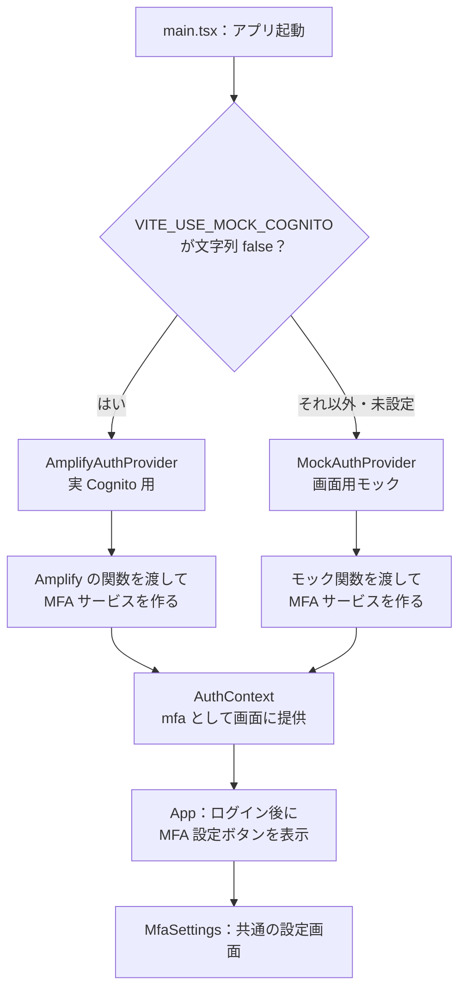
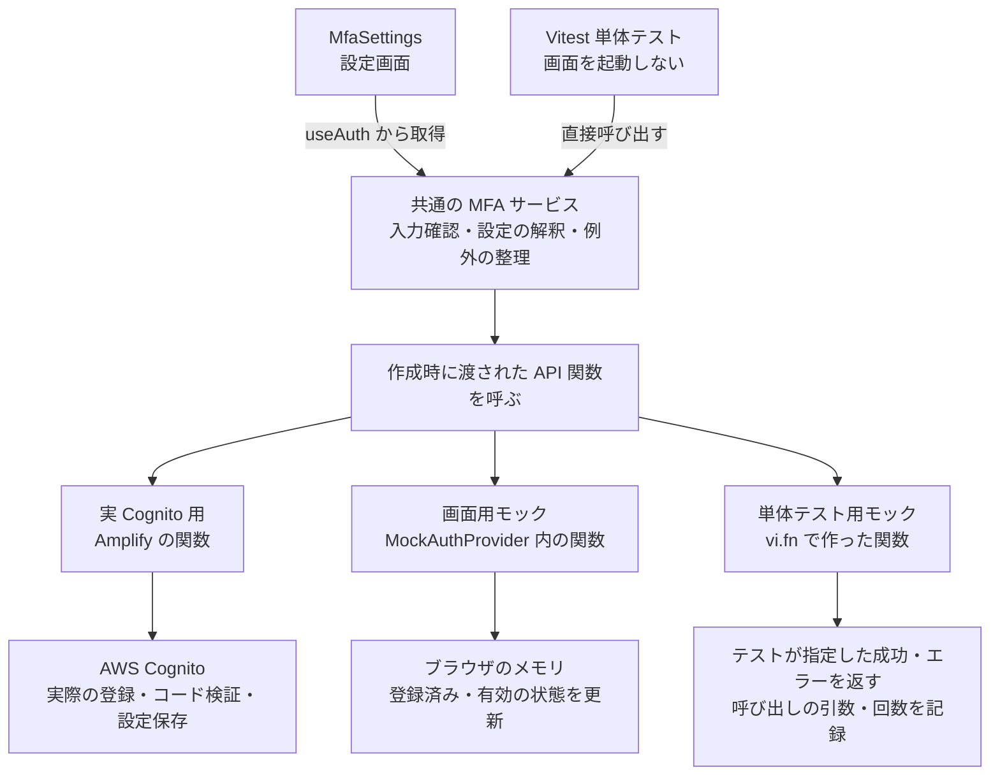
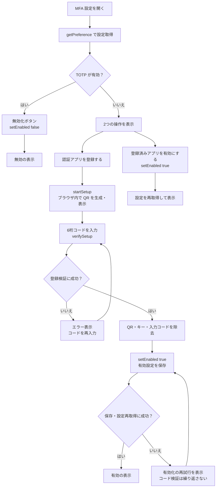

# MFA のフロントエンド実装とモックの分岐

MFA 実装は、①起動時の接続先選択、②共通の MFA 処理、③画面の状態分岐、の3つに分けて見る。
画面用モックと単体テスト用モックも、別のものとして整理する。

## 目次

- [全体像](#全体像)
- [起動時：どちらの Provider を使うか決める](#起動時どちらの-provider-を使うか決める)
- [呼び出し先：共通処理に渡す関数を変える](#呼び出し先共通処理に渡す関数を変える)
- [画面内：有効設定と操作の進行で分かれる](#画面内有効設定と操作の進行で分かれる)
- [実装ファイルと関連文書](#実装ファイルと関連文書)

## 全体像

| 実行するもの | MFA 設定画面 | 共通の MFA 処理 | その先の呼び出し |
| --- | --- | --- | --- |
| 実 Cognito のアプリ・実環境 E2E | 使用する | 使用する | Amplify → Cognito |
| モックのアプリ・モック E2E | 同じ画面を使用する | 同じ処理を使用する | ブラウザ内のモック |
| Vitest 単体テスト | 使用しない | 直接呼び出す | `vi.fn()` のモック |

## 起動時：どちらの Provider を使うか決める

この切り替えは、既存の `main.tsx` にある仕組み。任意 MFA の追加では、両方の Provider に MFA の機能を追加した。

`AuthContext` は、選んだ機能を画面へ渡すための仕組み。
`MfaSettings` の中には、「モックならこの処理、実 Cognito ならこの処理」という分岐はない。
`useAuth()` から受け取った `mfa` を呼ぶ。

## 呼び出し先：共通処理に渡す関数を変える

`createMfaService(api)` が、共通の MFA 処理を作る。`api` は、呼び出し先の関数をまとめたもの。

図の3本の枝は、作成時にどの関数を渡したかを表す。
MFA サービスの内部で毎回モードを判定しているわけではない。
共有するのは実装であり、アプリと単体テストはそれぞれ別のサービスのインスタンスを作る。

画面から見える操作と、その先の関数は次の対応となる。

| 画面が呼ぶ共通操作 | 渡された API の関数 |
| --- | --- |
| `getPreference()`：設定を取得 | `fetchMFAPreference()` |
| `startSetup()`：登録用情報を取得 | `setUpTOTP()` |
| `verifySetup(code)`：6桁を確認して登録検証 | `verifyTOTPSetup()` |
| `setEnabled(true / false)`：有効化・無効化 | `updateMFAPreference()` |

モックにも違いがある。

- **画面用モック**は状態を持つ。固定コード `123456` で登録成功にし、有効化・無効化をメモリに反映する。画面操作を続けて試すためのもの。ページを再読み込みするとモックの状態は初期化される。
- **単体テスト用モック**はテストごとに作る。「保存が失敗する」「有効方式が空」といった条件を指定し、共通処理の動きを確認するためのもの。

どちらも Cognito 自体を再現しているわけではない。実際のコード検証や認証要求は実環境 E2E で確認する。

## 画面内：有効設定と操作の進行で分かれる

設定取得に成功した後の、主な分岐を示す。

「無効」だけでは、未登録なのか、登録済みで無効化されているのかを区別できない。
そのため、登録と再有効化の両方を表示する。

これはログイン後の MFA 設定画面。実際のサインイン時の TOTP 入力画面は、引き続き Cognito が提供する。
任意 MFA の追加で、そのログイン画面を React に移したわけではない。

## 実装ファイルと関連文書

| ファイル | 役割 |
| --- | --- |
| [main.tsx](../frontend/src/main.tsx) | 起動時の Provider 選択 |
| [AmplifyAuthProvider.tsx](../frontend/src/auth/AmplifyAuthProvider.tsx) | Amplify の関数で MFA サービスを作成 |
| [MockAuthProvider.tsx](../frontend/src/auth/MockAuthProvider.tsx) | 状態を持つ画面用モックで MFA サービスを作成 |
| [AuthContext.tsx](../frontend/src/auth/AuthContext.tsx) | `mfa` を画面へ提供 |
| [mfaService.ts](../frontend/src/auth/mfaService.ts) | 共通の MFA 処理とエラー表示の変換 |
| [App.tsx](../frontend/src/App.tsx) | ログイン後の MFA 設定画面への切り替え |
| [MfaSettings.tsx](../frontend/src/components/MfaSettings.tsx) | 設定取得・QR・入力・操作の進行に応じた表示 |
| [mfaService.test.ts](../frontend/unit/mfaService.test.ts) | `vi.fn()` を渡して共通処理を単体テスト |

- [MFA のユースケースと認証フロー](./mfa-flows.md)：利用者の操作と Cognito との通信
- [任意 MFA の検証手順](./poc/006-optional-mfa.md)：設定・操作・検証結果
- [E2E テスト](../e2e/README.md)：接続構成と目的別の実行手順
- [ADR 0009 草案](./adr/0009-optional-mfa-self-service.md)：設計の理由
