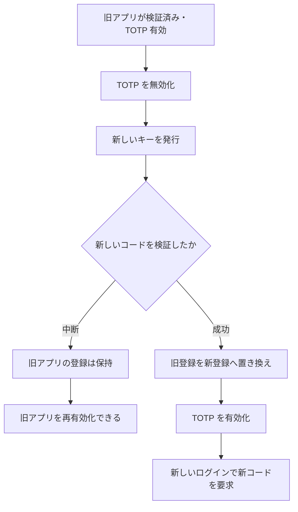
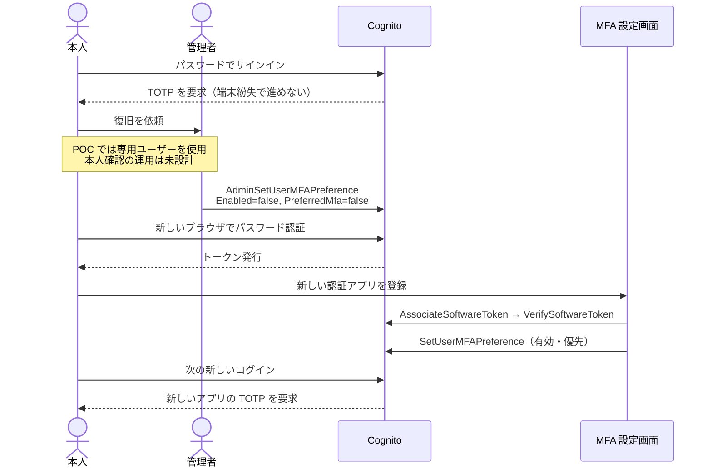
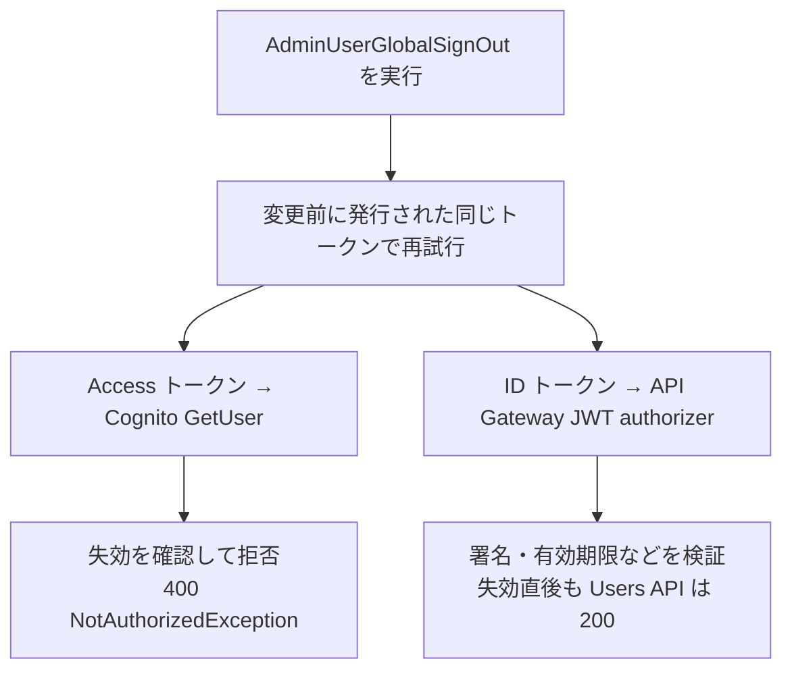

# 007: TOTP の再登録・紛失時の復旧と既存トークン

任意 MFA で、認証アプリの登録中断、端末変更、紛失からの復旧を確認する。
「認証アプリの登録」「MFA の有効設定」「発行済みトークン」を別の状態として扱う。

## 目次

- [検証の全体像](#検証の全体像)
- [ユースケース別の操作](#ユースケース別の操作)
  - [登録を中断してやり直す](#登録を中断してやり直す)
  - [認証アプリを別の端末へ変更する](#認証アプリを別の端末へ変更する)
  - [認証アプリを紛失して管理者に復旧を依頼する](#認証アプリを紛失して管理者に復旧を依頼する)
  - [変更前のトークンが使えるか確認する](#変更前のトークンが使えるか確認する)
- [自動テストの準備と実行](#自動テストの準備と実行)
- [確認結果と制約](#確認結果と制約)
- [関連文書](#関連文書)

## 検証の全体像

対象は **MFA OPTIONAL・TOTP 有効・Hosted UI classic** の構成。
本人の操作は既存の MFA 設定画面、管理者の操作は IAM 認証した AWS CLI を使う。
新しい管理者画面やバックエンドの復旧 API は追加しない。

| ユースケース | 操作する人 | 主に変わる状態 | 新しいログインで確認すること |
| --- | --- | --- | --- |
| [登録を中断してやり直す](#登録を中断してやり直す) | 本人 | 未検証のセットアップキー | 再開時の新しいキーで登録できる |
| [認証アプリを別の端末へ変更する](#認証アプリを別の端末へ変更する) | 本人 | 検証済みの TOTP 登録 | 新しいアプリで成功し、古いコードは拒否される |
| [認証アプリを紛失して管理者に復旧を依頼する](#認証アプリを紛失して管理者に復旧を依頼する) | 管理者 → 本人 | 有効設定 → TOTP 登録 | 一時的にパスワードで入り、新しいアプリを登録できる |
| [変更前のトークンが使えるか確認する](#変更前のトークンが使えるか確認する) | 本人・管理者 | 発行済みトークンの失効状態 | 新しいログインとは別に、既存トークンの利用可否を調べる |

## ユースケース別の操作

### 登録を中断してやり直す

1. MFA 設定画面で「認証アプリを登録する」を選ぶ。
2. コードを検証する前に「登録を中断する」を選ぶ。QR とキーが画面から消える。
3. 登録を開始し直す。新しいセットアップキーが発行される。
4. 中断前のキーのコードが拒否され、現在のキーのコードで登録できることを確認する。

「登録を中断する」は画面の情報を消す操作。Cognito に登録取消 API を送る操作ではない。
登録済みアプリを置き換えようとして中断した場合、新しいキーの検証前なら、以前の検証済みアプリを再有効化して使えるかを確認する。
中断時にアプリ側で無効化した設定は、自動で有効に戻らない。

### 認証アプリを別の端末へ変更する

現在の画面では、有効状態から直接再登録するボタンを提供していない。次の手順で置き換える。

1. 現在の認証アプリでサインインする。
2. MFA 設定画面で TOTP を無効にする。
3. 新しい端末の認証アプリで、新しく発行した QR を読み込む。
4. 新しいアプリのコードを検証し、TOTP を有効にする。
5. Cookie と保存領域を引き継がないブラウザで、旧コードの拒否と新コードでの成功を確認する。



Cognito が旧登録を置き換えるのは `VerifySoftwareToken` による新しいコードの検証時。
キー発行だけと、検証成功を分けて扱う。[AWS：AssociateSoftwareToken](https://docs.aws.amazon.com/cognito-user-identity-pools/latest/APIReference/API_AssociateSoftwareToken.html)。

この手順は、無効化から再有効化までパスワードだけで新しいログインができる時間を作る。
その時間を作らない端末移行 UI の設計は、この POC の対象外。

### 認証アプリを紛失して管理者に復旧を依頼する

TOTP を要求されるユーザーが認証アプリを失った場合、パスワードだけでは新しいログインを完了できない。
OPTIONAL のプールでは、管理者がそのユーザーの TOTP 有効設定を解除し、本人が再登録する経路を検証できる。



管理者の無効化だけでは旧シークレットは削除されない。**新しいアプリの登録検証まで完了して**旧登録を置き換える。
[AWS：AdminSetUserMFAPreference](https://docs.aws.amazon.com/cognito-user-identity-pools/latest/APIReference/API_AdminSetUserMFAPreference.html)。

MFA 必須のプールへ、このパスワードのみの復旧手順をそのまま適用できるとは考えない。
復旧依頼時の本人確認、権限付与、監査、通知は本番向けに別途設計する必要がある。

手動検証の管理者操作は以下の形で行う。プロファイル・リージョン・プール・ユーザーは専用の検証対象に置き換える。

```bash
aws cognito-idp admin-set-user-mfa-preference \
  --profile poc --region ap-northeast-1 \
  --user-pool-id ap-northeast-1_EXAMPLE \
  --username mfa-recovery-dedicated@example.com \
  --software-token-mfa-settings Enabled=false,PreferredMfa=false
```

### 変更前のトークンが使えるか確認する

新しいログインで TOTP が変わったことと、既存セッションが終了したことは別の確認になる。
テストは変更前に発行された **同じ ID・Access トークン** を保持し、更新せずに次の2経路へ送る。

| 接続先 | 送るトークン | 検証する内容 |
| --- | --- | --- |
| Cognito `GetUser` | Access トークン | Cognito が失効済みとして拒否するか |
| API Gateway → Users API | ID トークン | 既存 JWT authorizer がリクエストを許可するか |

再登録・管理者による MFA 無効化の後と、`AdminUserGlobalSignOut` の後を比較する。
Cognito のトークン失効が、署名と期限を検証するすべての API の即時拒否を意味するわけではない。
[AWS：トークンの失効](https://docs.aws.amazon.com/cognito/latest/developerguide/token-revocation.html)。



この図は現在の構成での実測。API 側で即時停止を保証したい場合は、失効を確認する認可の仕組みを別途設計する必要がある。

## 自動テストの準備と実行

既存の OPTIONAL 環境と `frontend/.env` の接続設定を使用する。
Git 管理外の `e2e/.env.e2e` に、ほかのシナリオと分離した恒久パスワード設定済みユーザーを指定する。
TOTP は未登録または無効の状態で開始する。

```dotenv
MFA_RECOVERY_USER_EMAIL=mfa-recovery-dedicated@example.com
MFA_RECOVERY_USER_PASSWORD=replace-with-test-password
MFA_RECOVERY_USER_POOL_ID=ap-northeast-1_EXAMPLE
MFA_RECOVERY_AWS_REGION=ap-northeast-1
MFA_RECOVERY_AWS_PROFILE=poc
```

AWS CLI と、そのプロファイルの有効な認証セッションが必要。
実行主体には `GetUserPoolMfaConfig`、`AdminGetUser`、`AdminSetUserMFAPreference`、`AdminUserGlobalSignOut` の権限を対象プールへ付与する。

```bash
npm --prefix e2e run test:unit
CI=1 npm --prefix e2e run test:e2e:mfa-recovery
```

通常の実環境 E2E ではこのシナリオをスキップする。専用コマンドはユーザーの登録を置き換え、全 Cognito セッションを失効させる。
管理者ヘルパーは `mfa-recovery-…@example.com` 以外のユーザーと、OPTIONAL・TOTP 有効以外のプールを拒否する。
各管理者操作の直前にもプールの設定を再確認する。
終了処理で TOTP を無効化し、全 Cognito セッションを失効させる。シークレットの関連付けは残る。
プロセス強制終了や AWS 接続失敗では終了処理が完了しないことがある。再実行前に専用ユーザーの状態を確認する。
実環境の QR・キー・コード・トークンはスクリーンショットやトレースに保存しない。

## 確認結果と制約

Essentials・Hosted UI classic（バージョン1）・OPTIONAL の実環境で、以下を1つの連続したブラウザシナリオとして確認した。

| ユースケース | 実測結果 |
| --- | --- |
| 登録を中断してやり直す | 再開時に別のキーを発行。中断したキーのコードを拒否し、新しいキーで登録成功 |
| 認証アプリを別の端末へ変更する | 検証前の中断では旧アプリを再有効化してサインイン成功。新登録の検証後は旧コードを拒否し、新コードで成功 |
| 認証アプリを紛失して管理者に復旧を依頼する | 復旧前は TOTP 入力待ち。管理者無効化後は新しいブラウザでパスワード認証成功。再登録後は旧コードを拒否し、新コードで成功 |
| 変更前のトークンが使えるか確認する | 以下の表のとおり、MFA 設定変更と全セッション失効で結果が異なる |

| 変更前の同じトークンを使うタイミング | Cognito `GetUser`（Access） | Users API（ID） |
| --- | --- | --- |
| 再登録前 | 200 | 200 |
| 新しいアプリの登録検証・有効化後 | 200 | 200 |
| 管理者による MFA 無効化後 | 200 | 200 |
| 全セッション失効直後 | 400 `NotAuthorizedException` | 200 |

復旧ヘルパーの単体テスト5件、既存の TOTP コード生成テスト9件、追加 E2E の TypeScript 型検査と静的解析も成功。
管理者の操作は専用ユーザーのみを対象とし、User Pool の設定やインフラを変更していない。

未確認なのは、MFA ON の復旧、Managed Login バージョン2、Google Authenticator による端末間の手動移行、本番の本人確認手順。
全セッション失効後の Refresh トークンでの更新、Hosted UI Cookie の扱い、トークン有効期限を過ぎた後の API 拒否は、このテストでは測定していない。

## 関連文書

- [任意 MFA の画面と検証](./006-optional-mfa.md)
- [フロントエンド実装の分岐](../mfa-frontend-implementation.md)
- [E2E の接続構成と実行手順](../../e2e/README.md)
- [ADR 0010 草案](../adr/0010-mfa-recovery-poc.md)
