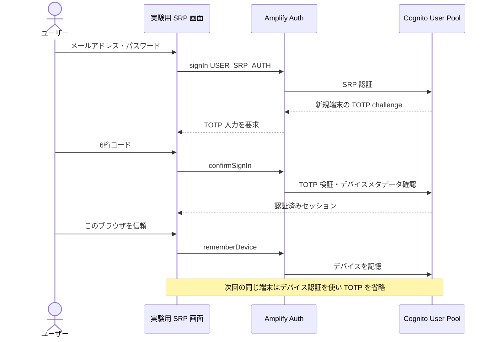

# 信頼するデバイス

既存の Hosted UI を維持し、専用の SRP ログインで Cognito の User Opt-In デバイス記憶を確認します。

## 目次

- [検証の概要](#検証の概要)
- [ログインとデバイス記憶](#ログインとデバイス記憶)
- [実行手順](#実行手順)
- [ブラウザで手動確認](#ブラウザで手動確認)
- [制約と確認事項](#制約と確認事項)
- [関連資料](#関連資料)

## 検証の概要

| 確認すること | 観測する状態 | 実行方法 |
| --- | --- | --- |
| 新しい端末の認証 | TOTP が要求され、端末は未登録 | POC 画面で SRP ログイン |
| 現在の端末を信頼 | Cognito に記憶され、次回同じ端末で MFA が省略される | 信頼後に再ログイン |
| 別端末の認証 | TOTP が要求される | 別ブラウザコンテキストでログイン |
| 信頼解除 | 現端末の記憶が消え、再ログインで TOTP が要求される | POC 画面で解除後に再ログイン |
| 信頼とトークン期限 | デバイス状態と各 JWT の `exp` を別々に表示 | ログイン後の状態画面 |

開始時は TOTP 未登録または無効の専用ユーザーを使います。E2E が TOTP を登録し、正常終了時に無効へ戻します。

## ログインとデバイス記憶



Hosted UI はそのまま利用できます。デバイス POC の専用画面だけが User Pools API の SRP 認証を使います。

## 実行手順

1. [Terraform 設定例](../../terraform/app/examples/mfa-trusted-device.tfvars.example)を既存設定に重ねて適用し、OPTIONAL TOTP と User Opt-In デバイス記憶を有効にします。
2. 専用 Cognito ユーザーを作成し、初回ログイン可能な状態にします。MFA は未登録または無効にします。
3. `e2e/.env.e2e.example` を基に、専用ユーザーのメール・パスワードを Git 管理外の `e2e/.env.e2e` に設定します。
4. 実環境 E2E を実行します。

```bash
CI=1 npm --prefix e2e run test:e2e:mfa-device
```

テストは専用ユーザーに TOTP を登録し、シークレットを実行中のメモリーだけで使います。正常終了時は TOTP を無効に戻し、デバイス記憶を変更します。異常終了時は状態が残る可能性があります。

## ブラウザで手動確認

1. Managed Login で専用ユーザーにサインインします。
2. 「MFA 設定」で TOTP を登録・有効化し、サインアウトします。
3. ホームの「信頼するデバイス POC（SRP ログイン）」から再ログインし、TOTP を入力します。
4. 「このブラウザを信頼する」を押してサインアウトし、同じブラウザから再ログインします。MFA が省略されることを確認します。
5. 「この端末の信頼を解除」後にサインアウトして再ログインし、TOTP が再要求されることを確認します。
6. 別ブラウザから同じ専用ユーザーでログインし、TOTP が要求されることを確認します。

終了時は Managed Login に戻って TOTP を無効化できます。信頼解除は Cognito のデバイス状態を変更しますが、すでに発行されたトークンはその操作だけでは失効しません。

## 制約と確認事項

- TOTP の登録と有効化には既存の Hosted UI / MFA 設定画面を使います。SRP 実験画面はログインとデバイス記憶のみを扱います。
- Cognito の記憶済みデバイスに自動有効期限はありません。期限を設けるにはアプリ側で期限を管理して、記憶状態を解除する設計が必要です。この POC は期限ポリシーを実装しません。
- アクセストークンと ID トークンの期限はデバイスの信頼状態と独立しています。信頼解除だけでは発行済みトークンや現在のセッションを失効しません。
- リフレッシュトークンの有効期間は User Pool Client の設定で決まり、JWT の `exp` から読み取る値ではありません。この画面はアクセストークンと ID トークンの `exp` を表示します。
- 信頼済み端末での MFA 省略はログイン経路に依存します。Hosted UI / Managed Login ではなく、専用 SRP 経路で検証します。
- シークレット、コード、トークン、デバイスキーをログやキャプチャに保存しません。

## 関連資料

- [AWS: Cognito ユーザーデバイスの記憶と認証](https://docs.aws.amazon.com/cognito/latest/developerguide/amazon-cognito-user-pools-device-tracking.html)
- [Amplify Auth: Remember a device](https://docs.amplify.aws/gen1/react/build-a-backend/auth/remember-device/)
- [設計判断の草案: ADR 0011](../adr/0011-trusted-device-srp-poc.md)
- [E2E テスト手順](../../e2e/README.md)
