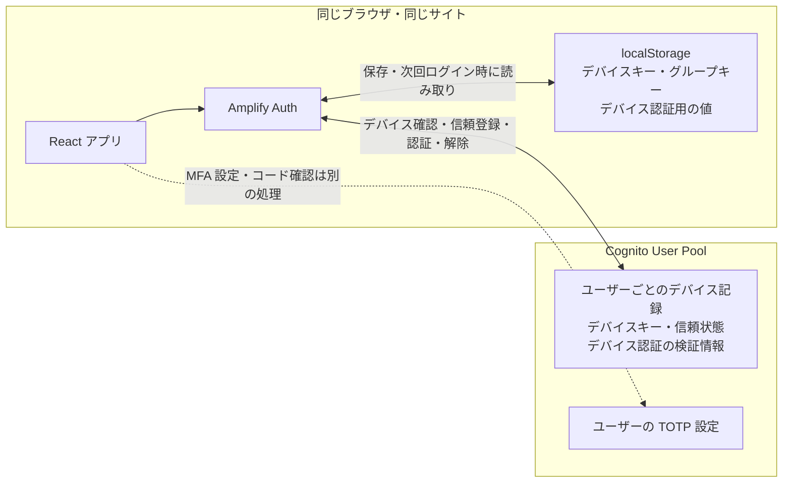
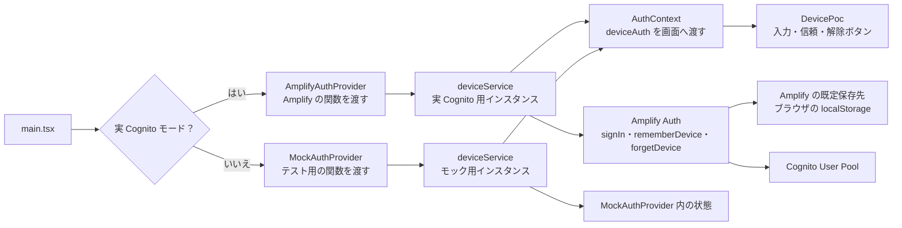

# 信頼するデバイスの保存先と実装

この POC では、Cognito がユーザーごとのデバイス記録を持ち、ブラウザの Amplify Auth が次回そのデバイスを示す情報を保持する。どこに何が残るかと、アプリから保存処理までの呼び出しを整理する。操作手順は [POC 008](./poc/008-trusted-device.md) を参照する。

## 目次

- [保存先と保持する情報](#保存先と保持する情報)
- [アプリから保存処理まで](#アプリから保存処理まで)
- [操作ごとの状態変化](#操作ごとの状態変化)
- [表示の判定と確認方法](#表示の判定と確認方法)
- [関連コードと仕様](#関連コードと仕様)

## 保存先と保持する情報

| 保存先 | 保持するもの | 役割 |
| --- | --- | --- |
| Cognito | ユーザーに紐づくデバイスキー、信頼状態、デバイス認証の検証情報 | そのデバイスを信頼するかを判断する |
| ブラウザの `localStorage` | Amplify が管理するデバイスキー、デバイスグループキー、デバイス認証用の値 | 次回ログインで同じデバイスだと示す |

ここでの「同じデバイス」は、物理的な PC そのものではなく、**同じサイトの保存情報を持つブラウザ環境**を指す。別のブラウザ・プロファイル・シークレットウィンドウや、サイトデータを消した後のブラウザは、元の保存情報を使えない。Cognito 側のデバイス記録は、ブラウザのデータを消しただけでは削除されない。

デバイス認証用の値は TOTP シークレットとは別物。認証アプリが保持する TOTP シークレットを、信頼するデバイスのために `localStorage` に保存する実装ではない。

## アプリから保存処理まで

`main.tsx` は起動時にどちらか一方の Provider を選ぶ。どちらも同じ `createDeviceService` から別のインスタンスを作る。`deviceService.ts` は `localStorage` を直接読み書きしない。実 Cognito 経路では、`AmplifyAuthProvider.tsx` が Amplify Auth の関数を渡す。画面は `AuthContext` の `deviceAuth` を呼ぶので、画面にも保存処理の分岐はない。

実 Cognito の経路で初めてログインに成功すると、Amplify は Cognito から新しいデバイスキーを受け取り、デバイスを確認登録する。この時点で Amplify は、次回のデバイス認証に使う情報を既定の保存先へ書き込む。Amplify Auth の現在のブラウザ向け既定保存先は `localStorage`。この POC は保存先を変更していない。

「このブラウザを信頼する」を押すと、`deviceService` の `rememberCurrentDevice()` が、渡された Amplify の `rememberDevice()` を呼ぶ。Amplify は保存済みのデバイスキーを読み、Cognito のデバイス状態を `remembered` に更新する。**ブラウザへのデバイス情報の保存はログイン時、信頼状態の更新はボタンを押した時**に行う。

モック経路では `MockAuthProvider` の関数を渡し、ブラウザ内のテスト用状態を変える。Cognito への通信も、Amplify による `localStorage` へのデバイス情報保存も行わない。

## 操作ごとの状態変化

| 操作 | ブラウザ側 | Cognito 側 |
| --- | --- | --- |
| 新しいブラウザで SRP・TOTP ログイン | Amplify がデバイス認証用の情報を保存 | 新しいデバイスを確認登録。信頼は別途選択 |
| 「このブラウザを信頼する」 | 保存済み情報を Amplify が読み取る | デバイスを `remembered` に更新 |
| サインアウト | 認証トークンを消す。デバイス情報は次回のため保持 | デバイスの信頼状態は継続 |
| 同じブラウザで再ログイン | 保存済み情報を使ってデバイス認証 | 信頼済みデバイスと確認できれば TOTP を省略 |
| 「この端末の信頼を解除」 | Amplify が現在のデバイス情報を消す | `ForgetDevice` でデバイス記録を削除 |
| ブラウザのサイトデータを削除 | デバイス情報も失う | 記録は残るが、元の情報を提示できない |

信頼解除は、すでに発行されたトークンの失効操作ではない。トークンの期限とデバイスの信頼状態は別々に扱う。

## 表示の判定と確認方法

POC 画面の「この端末：信頼済み」は、`deviceService.snapshot()` がアクセストークンの `device_key` と `fetchDevices()` の一覧の ID を照合して表示している。**Cognito の `device_status` 属性を直接判定した表示ではない**ため、信頼状態そのものの厳密な確認には、再ログイン時に TOTP が要求されるかを見る。デバイス一覧の取得とトークン期限の表示も、この `snapshot()` が行う。

ブラウザ側を確認する場合は、開発者ツールの **Application → Local Storage → 対象サイト**を開く。Amplify が管理するデバイス情報は認証に使う値なので、値をログ・スクリーンショット・公開ドキュメントに残さない。

## 関連コードと仕様

| コード | この文書での役割 |
| --- | --- |
| [main.tsx](../frontend/src/main.tsx) | 実 Cognito とモックの Provider 選択 |
| [AmplifyAuthProvider.tsx](../frontend/src/auth/AmplifyAuthProvider.tsx) | Amplify Auth の関数を `deviceService` に渡す |
| [MockAuthProvider.tsx](../frontend/src/auth/MockAuthProvider.tsx) | メモリ上の状態を使う画面用モックを渡す |
| [DevicePoc.tsx](../frontend/src/components/DevicePoc.tsx) | SRP ログイン、信頼・解除の画面操作 |
| [deviceService.ts](../frontend/src/auth/deviceService.ts) | ログイン結果の解釈、API 呼び出し、状態表示の判定 |

Amplify 内部では、Cognito の `NewDeviceMetadata` を受けてデバイスを確認登録し、トークン保存処理と同じストレージ経由でデバイス情報を保持する。利用中の Amplify Auth の実装を追う場合は、インストール済みパッケージの `getNewDeviceMetadata.ts`、`TokenStore.ts`、`CognitoUserPoolsTokenProvider.ts`、`DefaultStorage.ts` を参照する。ライブラリ更新時には内部のファイル構成や保存方法が変わる可能性がある。

- [AWS: Cognito ユーザーデバイスの記憶と認証](https://docs.aws.amazon.com/cognito/latest/developerguide/amazon-cognito-user-pools-device-tracking.html)
- [Amplify Auth: Remember a device](https://docs.amplify.aws/gen1/react/build-a-backend/auth/remember-device/)
