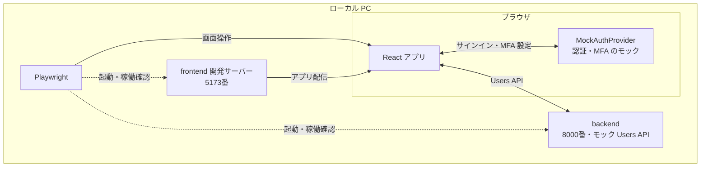
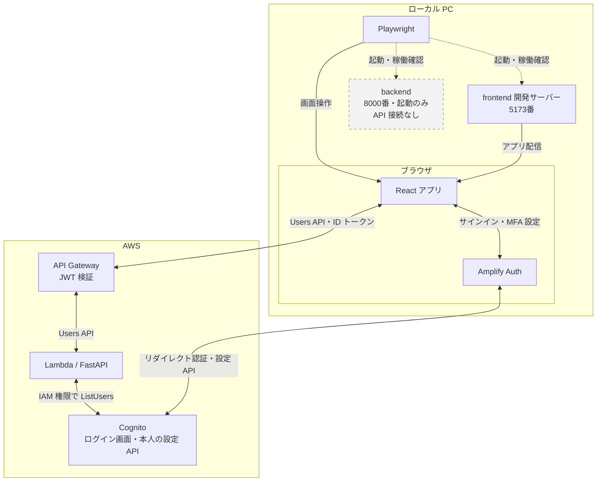

# E2E テスト (Playwright)

ブラウザから認証・MFA 設定・Users API を検証するパッケージです。
接続先と資格情報の仕組みを確認し、目的に合うシナリオを選んで実行します。
以下のコマンドは、特記がなければプロジェクトルートで実行します。

## 目次

- [セットアップ](#セットアップ)
- [接続先と資格情報の仕組み](#接続先と資格情報の仕組み)
  - [モックと実 Cognito の接続構成](#モックと実-cognito-の接続構成)
  - [設定ファイルの役割](#設定ファイルの役割)
  - [資格情報を1ファイルで管理する場合](#資格情報を1ファイルで管理する場合)
  - [任意 MFA の資格情報を分ける場合](#任意-mfa-の資格情報を分ける場合)
- [テスト用サーバーの起動](#テスト用サーバーの起動)
  - [毎回テスト用サーバーを起動する](#毎回テスト用サーバーを起動する)
  - [起動済みのサーバーを再利用する](#起動済みのサーバーを再利用する)
- [目的別の実行手順](#目的別の実行手順)
  - [AWS なしで画面と API 連携を確認する](#aws-なしで画面と-api-連携を確認する)
  - [実 Cognito でサインインと属性編集を確認する](#実-cognito-でサインインと属性編集を確認する)
  - [登録済み TOTP でサインインを確認する](#登録済み-totp-でサインインを確認する)
  - [任意 TOTP の登録・無効化・再有効化を確認する](#任意-totp-の登録無効化再有効化を確認する)
  - [TOTP コード生成だけを単体テストする](#totp-コード生成だけを単体テストする)
- [結果と画面キャプチャ](#結果と画面キャプチャ)
  - [出力先](#出力先)
  - [モック画面と実環境の記録範囲](#モック画面と実環境の記録範囲)

## セットアップ

```bash
npm --prefix frontend ci
uv sync --project backend
npm --prefix e2e ci
cd e2e
npx playwright install chromium
cd ..
```

## 接続先と資格情報の仕組み

### モックと実 Cognito の接続構成

**モック：認証・MFA 設定と Users API の両方をローカルで確認する**



**実 Cognito：認証・MFA 設定と Users API の接続先が AWS に変わる**



実線はブラウザ操作・アプリ配信・認証・API 通信、点線はテスト用サーバーの起動と稼働確認です。
モックでは AWS に接続しません。実 Cognito ではローカル backend も起動しますが、ブラウザの API 呼び出しは AWS に向かいます。
図は既定のローカル frontend を検証する構成です。

| モード | ブラウザでの認証 | Users API の接続先 | AWS の準備 |
| --- | --- | --- | --- |
| モック | React の MockAuthProvider | ローカルのモック backend | 不要 |
| 実 Cognito | Cognito のログイン画面 | AWS 上の API Gateway | インフラとテストユーザーが必要 |

モックでは frontend に `VITE_USE_MOCK_COGNITO=true`、backend に `USE_MOCK_COGNITO=1` を指定します。
実 Cognito 用コマンドは `VITE_USE_MOCK_COGNITO=false` を指定します。

既定のブラウザ接続先は `http://localhost:5173` です。公開ページを検証する場合は `PLAYWRIGHT_BASE_URL` を指定します。
その URL を Cognito の許可済みコールバックに登録してください。公開ページの検証時も、現在の構成ではローカルサーバーを起動します。

### 設定ファイルの役割

| ファイル | 内容 | 必要なケース |
| --- | --- | --- |
| `frontend/.env` | Cognito・API Gateway の接続設定 | 実 Cognito |
| `e2e/.env.e2e` | テストユーザーの資格情報 | 実 Cognito。任意 MFA の資格情報も記載可能 |
| `e2e/.env.mfa-optional` | 任意 MFA 専用ユーザーの資格情報 | 専用ユーザーの設定を別ファイルで管理したい場合のみ |

資格情報ファイルは Git 管理外です。モック E2E に資格情報ファイルは不要です。
環境の選択は実行コマンドと接続設定で行い、`.env.mfa-optional` は専用ユーザーを分ける補助ファイルとして扱います。

### 資格情報を1ファイルで管理する場合

```bash
cp e2e/.env.e2e.example e2e/.env.e2e
```

| 検証する内容 | `.env.e2e` に設定する変数 |
| --- | --- |
| 通常のサインイン・属性編集 | `TEST_USER_EMAIL`、`TEST_USER_PASSWORD` |
| 登録済み TOTP のサインイン | 上記に加えて `TEST_USER_TOTP_SECRET` |
| 任意 TOTP の設定変更 | `MFA_OPTIONAL_USER_EMAIL`、`MFA_OPTIONAL_USER_PASSWORD` |

通常のユーザーと任意 MFA 専用ユーザーは分けます。任意 MFA テストは登録と有効設定を変更するためです。
既存の `frontend/.env.e2e` を使っている場合は `e2e/.env.e2e` に移します。

### 任意 MFA の資格情報を分ける場合

`MFA_OPTIONAL_USER_EMAIL` と `MFA_OPTIONAL_USER_PASSWORD` の2変数を `e2e/.env.mfa-optional` に記載し、`.env.e2e` からは除きます。

読み込みの優先順位は **シェルの環境変数 → `.env.e2e` → `.env.mfa-optional`** です。
先に設定された値は上書きされず、空文字も設定済みとして扱います。設定例の空欄を `.env.e2e` に残すと、補助ファイルの値は使われません。

## テスト用サーバーの起動

### 毎回テスト用サーバーを起動する

各シナリオのコマンド例では `CI=1` を指定し、設定の異なる既存サーバーを再利用しないようにします。
5173番と8000番のポートを空けて実行してください。既存サーバーがある場合は、再利用せず起動エラーになります。

`CI=1` は、そのコマンドの実行中だけ環境変数 `CI` を設定する記法です。
`playwright.config.ts` の `reuseExistingServer: !process.env.CI` がこの値を参照します。
外部の CI サービスへの送信は行いません。

### 起動済みのサーバーを再利用する

`CI` を未設定にして実行します。たとえばモックなら `npm --prefix e2e run test:e2e` です。
再利用する frontend の認証モード・API 接続先と、backend のモック設定を確認してください。
`CI=0` は文字列として値が存在するため、再利用を許可する指定にはなりません。

## 目的別の実行手順

| 目的 | 必要な準備 | 実行するスクリプト | AWS 上で変更される状態 |
| --- | --- | --- | --- |
| [画面と API 連携をローカルで確認](#aws-なしで画面と-api-連携を確認する) | ローカルの依存関係のみ | `test:e2e` | なし。モック内の状態を変更 |
| [実 Cognito のサインイン・属性編集](#実-cognito-でサインインと属性編集を確認する) | AWS 接続設定・通常のテストユーザー | `test:e2e:real` | テストユーザーの名前・電話番号 |
| [登録済み TOTP のサインイン](#登録済み-totp-でサインインを確認する) | 上記に加えて登録済み TOTP のシークレット | `test:e2e:real` | 同じスイートで名前・電話番号も更新。TOTP 登録は変更しない |
| [任意 TOTP の登録・設定変更](#任意-totp-の登録無効化再有効化を確認する) | OPTIONAL のプール・専用ユーザー | `test:e2e:mfa-optional` | TOTP 登録・有効設定。正常終了時は無効に戻す |
| [TOTP コード生成だけを確認](#totp-コード生成だけを単体テストする) | Node パッケージの依存関係のみ | `test:unit` | なし。ブラウザも起動しない |

実行コマンドと確認内容は各行のリンク先に記載しています。E2E のコマンド例は `CI=1` でサーバーを起動します。

### AWS なしで画面と API 連携を確認する

```bash
CI=1 npm --prefix e2e run test:e2e
```

モックのサインインと Users API に加え、MFA 登録・誤コードからの再試行・無効化・再有効化・登録中断を検証します。
実 Cognito の認証や TOTP 検証は行いません。

### 実 Cognito でサインインと属性編集を確認する

AWS 上のインフラ、`frontend/.env` の接続設定、通常のテストユーザーの資格情報を用意します。

```bash
CI=1 npm --prefix e2e run test:e2e:real
```

サインイン、認証後の API 呼び出し、パスワードリセット画面への遷移、プロフィール編集を検証します。
プロフィール編集は専用ユーザーの名前・電話番号を更新します。任意 MFA の設定変更シナリオは、このコマンドではスキップします。
一覧だけ確認する場合は `npm --prefix e2e run test:e2e:real -- --list` を実行します。

### 登録済み TOTP でサインインを確認する

認証アプリの初回登録を済ませ、通常のテストユーザーの `TEST_USER_TOTP_SECRET` に Base32 シークレットを設定します。
前項の `test:e2e:real` がパスワードの後に TOTP を入力します。シークレット未設定ならパスワード認証となるため、MFA 有効ユーザーでは設定が必要です。

使用済みコードの再利用を避け、次の30秒枠を待ちます。ログインを含むテストの制限時間は60秒です。
Hosted UI classic（バージョン1）で検証しています。Managed Login バージョン2は未検証です。
初回登録の手順と制約は [POC 005](../docs/poc/005-mfa-foundation.md) を参照してください。

### 任意 TOTP の登録・無効化・再有効化を確認する

MFA OPTIONAL のプールと、設定変更を許可した専用ユーザーの資格情報を用意します。
開始時の TOTP は未登録または無効にします。

```bash
CI=1 npm --prefix e2e run test:e2e:mfa-optional
```

登録 → 誤コードの拒否と再試行 → TOTP 付きサインインと Users API → 無効化後のパスワード認証 → 再有効化後の同じアプリによるサインインを検証します。
正常終了時は TOTP を無効に戻し、関連付けを保持します。中断・失敗時は変更が残る場合があるため、専用ユーザーの状態を確認してから再実行します。
詳細は [POC 006](../docs/poc/006-optional-mfa.md) を参照してください。

### TOTP コード生成だけを単体テストする

```bash
npm --prefix e2e run test:unit
```

コード生成関数を既知の入力と期待値で確認します。ブラウザ、資格情報、AWS 接続は不要です。
フロントエンドの MFA 設定ロジックの単体テストは [Frontend README](../frontend/README.md#単体テスト) を参照してください。

## 結果と画面キャプチャ

### 出力先

| 出力先 | 内容 |
| --- | --- |
| `e2e/test-results/` | テストの出力ファイル |
| `e2e/test-results/screenshots/` | 明示的に撮影したモック画面 |
| `e2e/playwright-report/` | HTML レポート |

いずれも Git 管理外です。モックのシナリオ一覧は `npm --prefix e2e run test:e2e -- --list` で確認できます。

### モック画面と実環境の記録範囲

モック E2E はホーム画面・Users API と、MFA の無効状態・登録画面・誤コード・有効状態を撮影します。
登録画面の QR はモック専用の固定値です。
実 Cognito では QR・シークレット・コード・トークンを保存しないよう、スクリーンショットを撮影せず、トレースと失敗時のページスナップショットを無効化しています。

[プロジェクト README へ戻る](../README.md)
